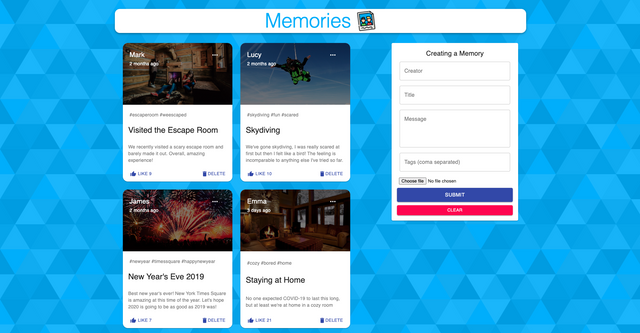

# Social-Media-MERN

A simple social media application that allows users to post interesting events that happened in their lives - developed using React, Node, Express and MongoDB.
<br/>
<br/>
Prerequirements
- MongoDB
- Node ^10.0.0
- npm

Client-side usage(PORT: 3000):<br/>
```
$ cd client   // go to client folder
$ npm i       // npm install pacakges
$ npm start       
```
Server-side usage(PORT: 5000):<br/>
```
$ cd server   // go to server folder
$ npm i       // npm install pacakges
$ npm start 
```
Note that you need client and server running concurrently in different terminal sessions.
<br/>
<br/>



